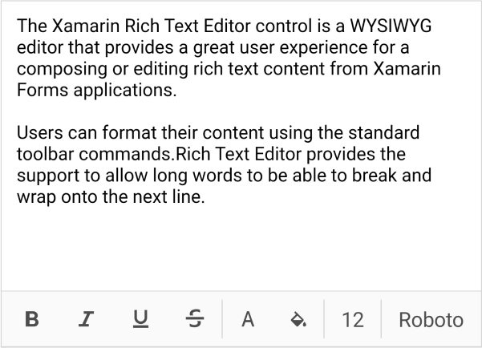
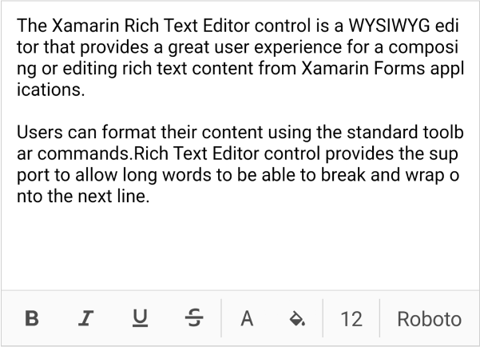

# Basic Features in Xamarin Rich Text Editor (SfRichTextEditor)

## Setting Text

The Xamarin Rich Text Editor control displays the text/formatted text(HTML string) that can be set using the [`Text`](https://help.syncfusion.com/cr/xamarin/Syncfusion.XForms.RichTextEditor.SfRichTextEditor.html#Syncfusion_XForms_RichTextEditor_SfRichTextEditor_Text) property.

 

 

 <richtexteditor:SfRichTextEditor VerticalOptions="FillAndExpand" Text= "The &lt;b&gt; rich text editor &lt;/b&gt; component is WYSIWYG editor that provides the best user experience to create and update the content" />



 
richtexteditor = new SfRichTextEditor()
{
	VerticalOptions = LayoutOptions.FillAndExpand,			
	Text = "The <b>rich text editor</b> component is WYSIWYG editor that provides the best user experience to create and update the content";
};
this.Content = richtexteditor;




## Retrieving HTML text

The formatted text of Rich Text Editor can be retrieved using the [`HtmlText`](https://help.syncfusion.com/cr/xamarin/Syncfusion.XForms.RichTextEditor.SfRichTextEditor.html#Syncfusion_XForms_RichTextEditor_SfRichTextEditor_HtmlText) property of [`SfRichTextEditor`](https://help.syncfusion.com/cr/xamarin/Syncfusion.XForms.RichTextEditor.SfRichTextEditor.html).

 

 

string HTMLText = richtexteditor.HtmlText;





## InsertHTMLText

Rich Text Editor provides the support to insert the HTML text or raw text at the current cursor position. The following code example explains how to insert a text in the Rich Text Editor.

 

 
richtexteditor.InsertHTMLText("New text content");




## GetSelectedText

Rich Text Editor provides the support to get the selected text using the [`GetSelectedText`](https://help.syncfusion.com/cr/xamarin/Syncfusion.XForms.RichTextEditor.SfRichTextEditor.html#Syncfusion_XForms_RichTextEditor_SfRichTextEditor_GetSelectedText) method of [`SfRichTextEditor`](https://help.syncfusion.com/cr/xamarin/Syncfusion.XForms.RichTextEditor.SfRichTextEditor.html).

 

 
string selectedText = richtexteditor.GetSelectedText();




## TextChanged 

The TextChanged event will be triggered in the Rich Text Editor for every text change action in the content.

 

 

 <rte:SfRichTextEditor x:Name="richtexteditor" TextChanged="Richtexteditor_TextChanged" VerticalOptions="FillAndExpand"/>



 
SfRichTextEditor richtexteditor = new SfRichTextEditor();
richtexteditor.TextChanged += Richtexteditor_TextChanged;
this.Content = richtexteditor;
			
private void Richtexteditor_TextChanged(object sender, Syncfusion.XForms.RichTextEditor.TextChangedEventArgs e)
{
	string text = e.Text;
}




## FormatChanged 

The FormatChanged event will trigger in the Rich Text Editor if any format change occurs in the content such as bold, italic, underline, and other formatting supports provided in the toolbar.

 

 

 <rte:SfRichTextEditor x:Name="richtexteditor" FormatChanged="Richtexteditor_FormatChanged" VerticalOptions="FillAndExpand"/>



 
SfRichTextEditor richtexteditor = new SfRichTextEditor();
richtexteditor.FormatChanged += Richtexteditor_FormatChanged;
this.Content = richtexteditor;
			
private void Richtexteditor_FormatChanged(object sender, FormatChangedEventArgs e)
{
	bool isBold = e.bold;
}





The following code example explains how to get Fontname in format changed event.

 

 
SfRichTextEditor richtexteditor = new SfRichTextEditor();
richtexteditor.FormatChanged += Richtexteditor_FormatChanged;
this.Content = richtexteditor;
            
private void Richtexteditor_FormatChanged(object sender, FormatChangedEventArgs e)
{
    string fontName = e.Formats.fontname;
}





While changing the font format, we can able to get the font name because  we expose this property as public.

## HyperlinkSelected

The ['HyperlinkSelectedEvent'](https://help.syncfusion.com/cr/xamarin/Syncfusion.XForms.RichTextEditor.SfRichTextEditor.html#Syncfusion_XForms_RichTextEditor_SfRichTextEditor_HyperlinkSelected) will be triggered when a selected text contains a hyperlink. The following code example explains how to create a TextChangedEvent trigger.

 

 

<rte:SfRichTextEditor x:Name="richtexteditor" VerticalOptions="FillAndExpand" HyperlinkSelected="Richtexteditor_HyperlinkSelected"/>



 
SfRichTextEditor richtexteditor = new SfRichTextEditor();
richtexteditor.HyperlinkSelected += Richtexteditor_HyperlinkSelected;
this.Content = richtexteditor;
			
private void Richtexteditor_HyperlinkSelected(object sender, HyperlinkSelectedEventArgs e)
{
    string displayText = e.DisplayText;
    string urlText = e.URL;
}





## Cursor Position

 Rich Text Editor provides the support to get or set the current cursor position based on the character count in the rich text editor. The following code example explains how to get or set a cursor position in the Rich Text Editor.
 
  

 

//To get current cursor position
int CurrentPosition = richtexteditor.CursorPosition;

//To set current cursor position
richtexteditor.CursorPosition = 10;





N> Set the CursorPosition based on the character count will not working in the Xamarin RichTextEditor iOS due to the control focus limitation.

## Content Height

Rich Text Editor provides the support to get the height of the rendered content. The following code example explains how to get the rendered content height in the Rich Text Editor. 

 

 

//To get height of the rendered content.
int ContentHeight = richtexteditor.ContentHeightRequest;





N> This is a readonly property.

## Word Wrap

Rich Text Editor provides the support to allow long words to be able to break and wrap onto the next line.
The enum `Word Wrap` has two constants: Normal, BreakWord. The default value is BreakWord.

### Normal 
Specifies to break words only at allowed break points.

### BreakWord 
Specifies the unbreakable words to be broken

The following code example explains how to set a word wrap in the Rich Text Editor. 

 

 

 <rte:SfRichTextEditor x:Name="richtexteditor"  VerticalOptions="FillAndExpand" WordWrap="BreakWord"/>



 
SfRichTextEditor richtexteditor = new SfRichTextEditor();
richTextEditor.WordWrap = WordWrap.BreakWord;





## RichTextEditor scrolls in scroll view layout

RichTextEditor relies on WebView for rendering the HTML content and, as there is a limitation for placing the WebView inside the ScrollView control. As in [MSDN](https://docs.microsoft.com/en-us/xamarin/xamarin-forms/user-interface/layouts/scrollview#usage), the ScrollViews should not be nested with other controls that provide scrolling like ListView and WebView. So, the scrolling is not working in the SfRichTextEditor, which is inside the ScrollView in Android. This is known as the [LimitationOfWebView](https://help.syncfusion.com/xamarin/rich-text-editor/overview#limitations).

To overcome this issue, you can scroll either parent layout or RichTextEditor but not both. This can be done by enabling the `ScrollOrientation` property to `None` (i.e., RichTextEditor will not scroll). The default value is `Vertical` (i.e., RichTextEditor scrolls vertically). 

N> It applies to android only. Since iOS and UWP do not have the limitation in a scroll view. It can scroll either in scroll layout or within the control but not both due to the WebView limitation.

 

 

<ScrollView>
    <StackLayout>
        <richtexteditor:SfRichTextEditor ScrollOrientation="None" HeightRequest="500" Text="The rich text editor component is WYSIWYG editor that provides the best user experience to create and update the content." />
        <richtexteditor:SfRichTextEditor ScrollOrientation="None" HeightRequest="500" Text="The rich text editor component allows Applies formatting such as bold, italics, and underline." />
    </StackLayout>
</ScrollView>





## StyleSheet

 The Rich Text Editor provides the support to customize the style sheet type to load html file from an external or internal file path by using the StyleSheetTypebindable property in the RichTextEditor.

### Default
 Loads the WebView resources through an external style sheet.

### Internal
 Loads the WebView resources through an internal style sheet.
 
  

  

  <richtexteditor:SfRichTextEditor x:Name="RichTextEditor" StyleSheetType="Internal"/>

 

  

SfRichTextEditor RichTextEditor = new SfRichTextEditor();
            
RichTextEditor. StyleSheetType= StyleSheetType.Internal;





N>It applies only to UWP users in China and Korea locations. It is not applicable in android an iOS ,Since android and iOS, can load the WebView resources using an external style sheet.

## Enable or disable system keyboard

The RichTextEditor supports restricting the system keyborad visibility while focusing on the RichTextEditor control. The default value is true.

 

 

<richtexteditor:SfRichTextEditor x:Name="RichTextEditor" EnableSystemKeyboard="True"/>



 

SfRichTextEditor RichTextEditor = new SfRichTextEditor();
            
RichTextEditor.EnableSystemKeyboard = true;





N> It applies to android and iOS only and not supported in UWP.

## Configure the HTML tag for enter key

The RichTextEditor supports preserving the dictation text after its comes with a new paragraph and a new line using `div` Html tag.

 

 

<richtexteditor:SfRichTextEditor x:Name="RichTextEditor" EnterKey="Div"/>



 

SfRichTextEditor RichTextEditor = new SfRichTextEditor();
            
RichTextEditor.EnterKey = EnterKey.Div;





N> This property works when loading the control only. It applies to iOS only and not supported in Android and UWP.
